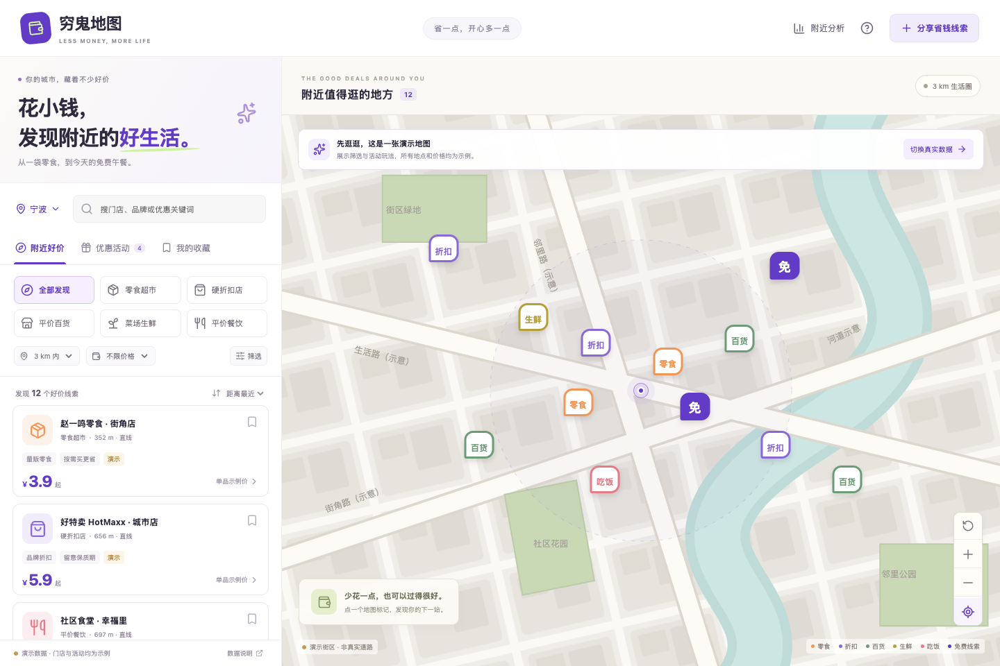

# 穷鬼地图

把零食折扣、平价百货、日常吃饭和有条件说明的免费活动放在同一张地图上。第一版为手机优先的 Web 应用，使用 React + TypeScript + Vite，Node/Express 提供高德查询与密钥代理。



## 运行

需要 Node.js 22.12+（本次使用 Node 24）。

```sh
npm ci
npm run dev
```

打开 http://127.0.0.1:5173 。API 在 `127.0.0.1:8787`。不配置密钥也能体验演示，所有示例门店、地址、商品价格和活动均为虚构，不可据此出行。演示底图是代码绘制的街区示意，不是真实城市道路。

构建后可通过同一个 Node 服务运行：

```sh
npm run build
npm start
```

此时打开 http://127.0.0.1:8787 。目前只绑定本机，没有部署到公网。

## 已实现的路径

- 选择城市，按零食超市、硬折扣、平价百货、菜场生鲜、平价餐饮筛选；按关键词、半径、预算和距离/价格排序。真实模式支持地址搜索、当前位置和移动地图后搜索区域。
- 地图标记与门店详情联动，查看直线距离、地址、价格线索和活动参与条件；真实门店可打开高德位置页面。
- 霸王餐、打卡福利、限时特价筛选，可额外选择免消费、无需抽签、有原始链接。参与成本为领取价 + 另需最低消费，不代表抽签必中或完整交通成本。
- 收藏保存在当前浏览器，并按当前查询范围筛选；本地活动投稿必须包含原始 HTTPS 链接、截止时间、参与条件和消费门槛。投稿为未核验线索，只保存在当前浏览器，不会上传或跨用户共享。
- 过期活动从筛选结果排除，打开页面期间每 30 秒重新检查。有效线索可在门店详情删除；多个同源浏览器标签页会同步收藏和线索。
- 附近分析展示当前结果的门店分类、免消费活动地点和最近直线距离。演示分析不代表实际城市，真实分析也只覆盖接口首批结果。

## 配置高德

```sh
cp .env.example .env
```

在高德开放平台申请并填写：

| 环境变量                | Key 类型与用途                     | 位置                                        |
| ----------------------- | ---------------------------------- | ------------------------------------------- |
| `AMAP_JS_KEY`           | Web 端 JS API Key，加载 JS API 2.0 | 可被浏览器看到的公开标识，需设置域名限制    |
| `AMAP_JS_SECURITY_CODE` | 对应 JS Key 的安全密钥             | 只留在服务端，通过 `/_AMapService` 代理附加 |
| `AMAP_WEB_SERVICE_KEY`  | 独立 Web 服务 Key，查询 POI 和地址 | 只留在服务端                                |

重启开发服务，点击页面「切换真实数据」。Key 配置存在不等于已验证：浏览器实际地图加载、周边查询成功和结果来源才是验收依据。SDK 或门店查询失败会显示错误，不会用示例替换。

真实模式用高德 `/v3/place/around` 搜索固定品牌/类别关键词，并按 POI ID 去重。当前每类别最多取首批 25 家，超过首批或部分类别失败会提示；默认一轮全部分类为 5 次请求，带 5 分钟内存缓存与请求频率限制。**高德地点数据不能证明价格便宜**，当前不推断价格、营业中状态或霸王餐。

距离以高德 GCJ-02 坐标计算直线距离，不是步行距离或时间。浏览器定位的 WGS84 坐标转换后用于查询。位置不写入浏览器存储，但查询坐标会发送到本地服务及高德。

## 为什么平台活动还没接上

2026-10-07 核对官方文档后，无法确认存在可直接供本应用读取“全城霸王餐”的通用接口。美团/大众点评需要申请合作及对应业务授权；抖音生活服务的商品查询针对商家或服务商及其授权账号，不等同于全平台活动搜索。因此本版不抓取登录态页面，不伪造平台接口，不把原始链接当作已核验事实。

下一阶段合理的数据源是商家授权接口或商家/用户投稿经审核后的共享活动库。具体证据与数据模型见 [docs/DATA_SOURCES.md](docs/DATA_SOURCES.md)。

## 验证与边界

```sh
npm run build
npm test
npm run test:e2e
```

浏览器测试使用已安装的 Chrome，包括桌面视口和 iPhone 13 尺寸的移动模拟。当前 18 项逻辑/接口测试、16 项浏览器场景通过；真实模式错误与恢复使用明确的测试返回数据。Chrome 手机模拟不能代替真实 iPhone/Safari 验收。

本次未提供高德密钥，所以真实 SDK、真实 POI、实际位置与高德跳转未完成端到端验收。大陆网络可达性未在大陆网络现场测试。没有平台授权活动、账号系统、服务端投稿库、审核后台、实时库存或价格比对。当前版本适合体验交互并接入自己的高德密钥，不应当作已上线的实时优惠平台。

开发依赖有 `npm` 锁文件；`npm audit` 当前为 0 漏洞。公网部署前需要配置同源 HTTPS 服务、域名限制与服务端密钥环境，并按预期用户量确认地图授权和额度。
